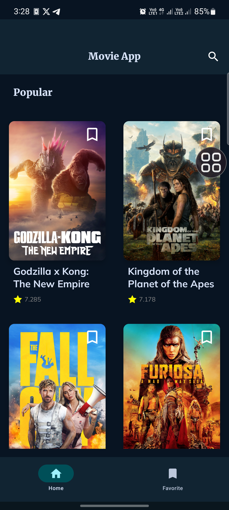
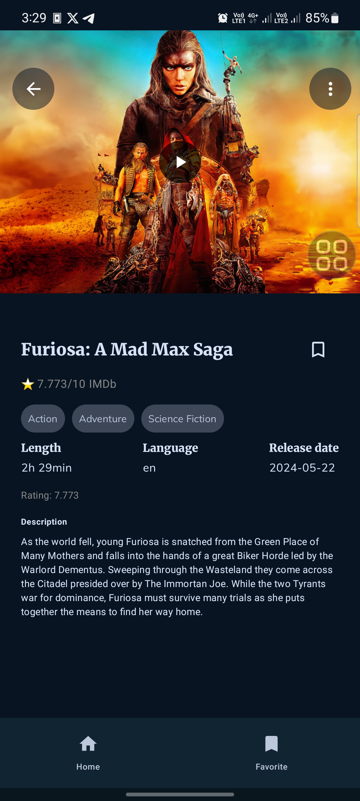
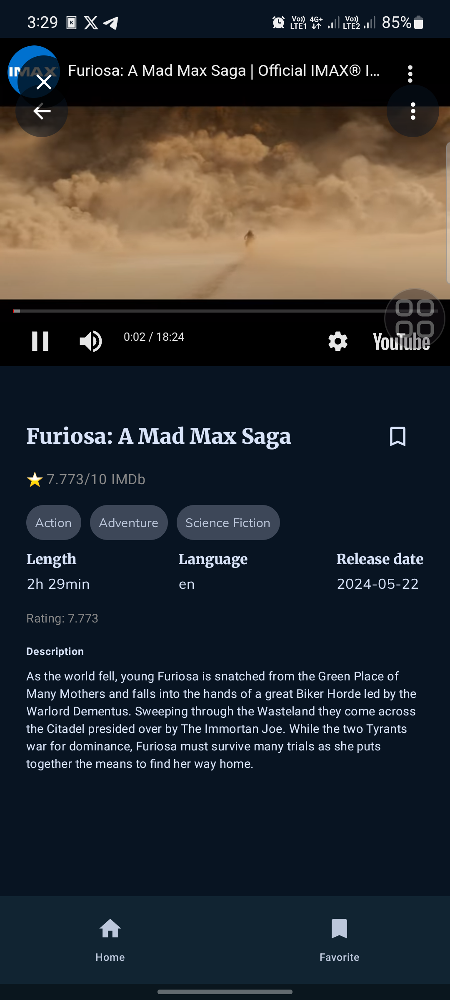
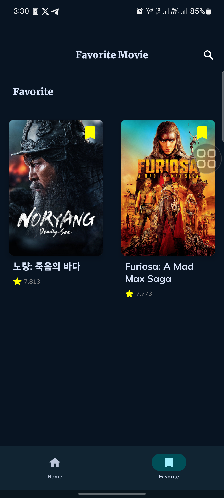
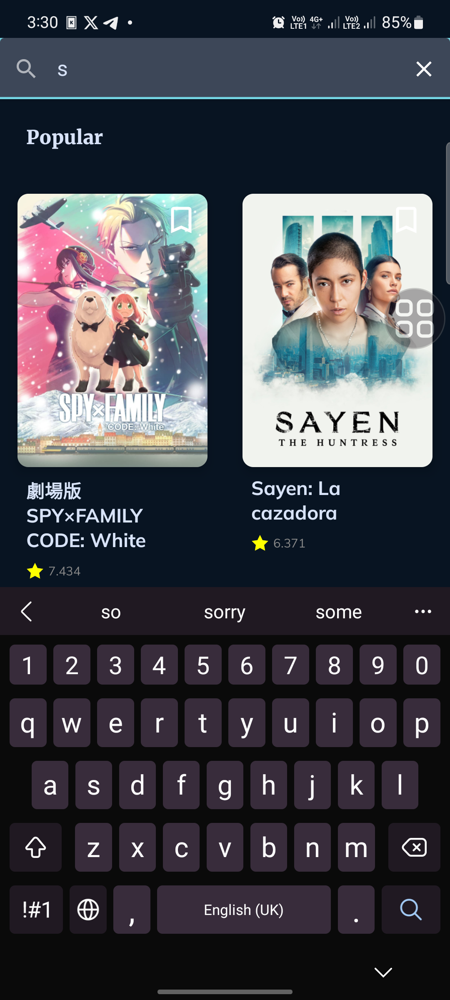
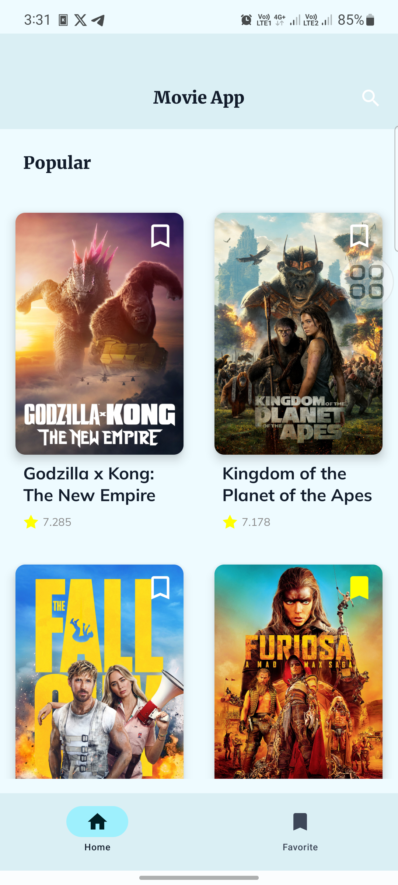
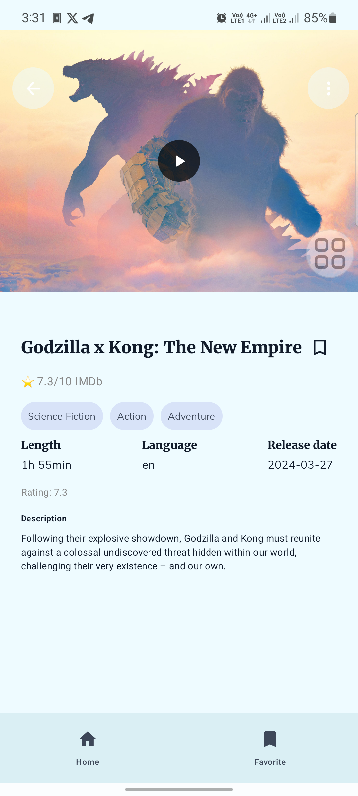
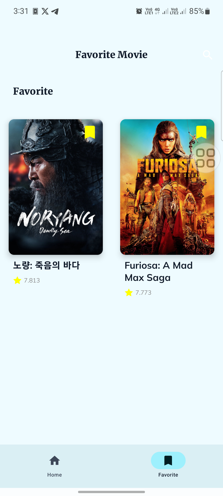
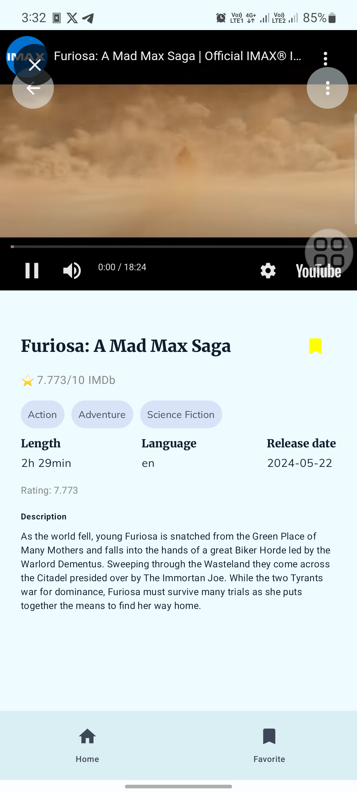
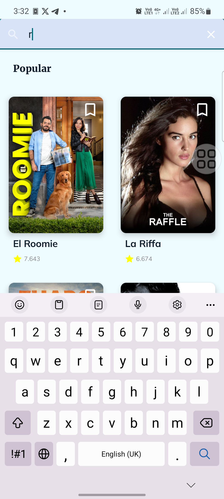

# MovieApplication Jetpack Compose

Welcome to the **MovieApplication Jetpack Compose** repository! This project demonstrates building a modern Android application using Jetpack Compose, Kotlin, and various Android libraries. The application interacts with a RESTful API to display a list of movies, allowing users to search for movies, view movie details, and manage a list of favorite movies.

|  |  | |
|-----------------------------------------|-----------------------------------------|----------------------------------------|
|  |  | |
|-----------------------------------------|-----------------------------------------|----------------------------------------|
|  |  | | 
|-----------------------------------------|-----------------------------------------|----------------------------------------|
| |

## Video

 https://github.com/mahmoud947/MovieApplication_jetpack_compose/assets/65209396/310ba2c0-cc3a-42b0-b681-2c128c9c8cbf 
 
 https://github.com/mahmoud947/MovieApplication_jetpack_compose/assets/65209396/227bc521-e32c-4c63-ad69-20774af12cea 


## Project Overview

- **Fetch Movie Data**: Use the TMDb API to fetch a list of popular movies.
- **Search Functionality**: Search for movies by title.
- **Movie Details**: Display detailed information about a selected movie.
- **Favorites List**: Add and remove movies from a favorites list stored using Room database.
- **UI Components**: Build UI using Jetpack Compose.
- **Asynchronous Operations**: Handle API calls and database operations with Kotlin Coroutines.
- **Dependency Injection**: Use Hilt for dependency injection.

## Features

1. **Home Screen**: Displays a list of popular movies with pagination.
2. **Movie Details Screen**: Shows detailed information about a selected movie, including the trailer.
3. **Favorite Screen**: Displays a list of favorite movies, allowing users to add or remove favorites.
4. **Search Functionality**: Search for movies by title using a search bar.
5. **Room Database**: Store and manage favorite movies locally.

## Installation

1. Clone the repository:
   ```bash
   git clone https://github.com/mahmoud947/MovieApplication_jetpack_compose.git
   ```
2. Open the project in Android Studio.
3. Sync the project with Gradle files.
4. Add your API key in the `local.properties` file:
   ```properties
   TMDB_API_KEY=your_api_key_here
   ```
5. Run the application on an emulator or physical device.

## Setup

### Dependencies

Ensure the following dependencies are added to your `build.gradle` files:
- Retrofit
- Room
- Coroutines
- Jetpack Compose
- Hilt
- [Easy Connectivity](https://github.com/mahmoud947/easy_connectivity) - This is my own library for handling network connectivity status.

## Architecture

The project follows the Clean Architecture approach, separating UI, domain, and data layers. Dependency injection is managed using Hilt.

### Clean Architecture Layers

- **UI Layer**: Contains the UI components and ViewModels.
- **Domain Layer**: Contains use cases and domain models.
- **Data Layer**: Contains repositories, data sources, and models for API and database interactions.
